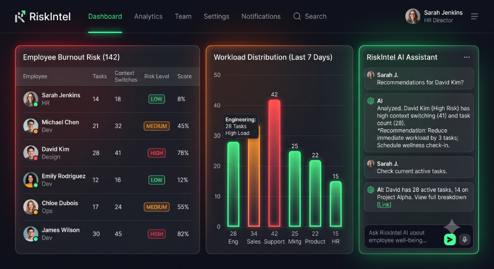

# CHARAN_SRI_DEV // Portfolio V1.0



A high-performance, minimalist developer portfolio built with **React 19**, **Vite**, **Tailwind CSS v4**, and custom **HTML5 Canvas** interactive particle animation systems. Designed for showcasing agentic AI projects, LLM systems, full-stack applications, and neural workflow automations.

---

## 🌟 Key Features

- **Interactive Neural Dot-Matrix Background**: Custom HTML5 Canvas rendering engine with mouse proximity falloff effect and dynamic resize listeners.
- **Bento Grid Deployment Showcase**: Highlighting 6 featured AI & Full-Stack engineering projects with uncropped aspect-ratio media containers and live links.
- **Dynamic Navigation Highlighting**: Powered by `IntersectionObserver` to automatically highlight current section tabs on scroll and click navigation.
- **Cyberpunk / Dark Minimalist Theme**: Curated dark design token system, frosted glassmorphism panels (`backdrop-blur-xl`), and custom monospace typography (`DotGothic16` & `Inter`).
- **Direct Mailto & Social Integration**: Seamless communication triggers connecting directly to Gmail web composer and professional channels.

---

## 🛠️ Tech Stack

- **Framework**: [React 19](https://react.dev/), [Vite 8](https://vitejs.dev/)
- **Styling**: [Tailwind CSS v4](https://tailwindcss.com/), `@tailwindcss/postcss`
- **Typography**: Google Fonts (`DotGothic16`, `Inter`, `Material Symbols Outlined`)
- **Deployment**: Static Bundle Export / Vercel / Render / Netlify

---

## 📂 Featured Projects Showcase

| # | Project | Description | Stack / Links |
|---|---|---|---|
| **001** | **Burnout Risk Analyzer** | Task-Level Employee Burnout Risk Detection System built for Xebia Hackathon. | React, AI, [Demo](https://task-level-employee-burn-risk-detection-39l2.onrender.com/) • [Code](https://github.com/charansridev/Task-Level-Employee-Burn-Risk-Detection-System) |
| **002** | **NewsTrack** | Full-stack supply chain & newspaper distribution management system with real-time tracking. | FastAPI, React, [Code](https://github.com/charansridev/NewsTrack) |
| **003** | **N8N Neural Workflows** | 16 specialized autonomous AI workflows (Groq Whisper, Gemini 2.5, Telegram bots, Suno API). | n8n, LangChain, [Repo](https://github.com/charansridev/N8N-AUTOMATIONS) |
| **004** | **DrishtiFi** | Multimodal AI credit-readiness assessment for offline MSMEs built for OpenAI Academy Buildathon. | React 19, Gemini 2.5, [Demo](https://drishtifi.ai.studio/) • [Code](https://github.com/charansridev/DrishtiFi) |
| **005** | **PolicyPay** | Full-stack life insurance daily payment CRM with one-click WhatsApp client reminders. | React 19, Express, MongoDB, [Demo](https://policy-crm-dashbord-hazel.vercel.app/) • [Code](https://github.com/charansridev/policyCRM-Dashbord) |
| **006** | **Voice to Invoice** | Telegram AI bot converting voice notes into structured JSON and downloadable PDF invoices. | n8n, Gemini 2.5, PDFShift, [Code](https://github.com/charansridev/voice-to-invoice) |

---

## 🚀 Local Development Setup

### Prerequisites

Ensure you have **Node.js** (v18+ recommended) installed.

### Installation

1. **Clone the Repository**:
   ```bash
   git clone https://github.com/charansridev/Portfolio-website.git
   cd Portfolio-website
   ```

2. **Install Dependencies**:
   ```bash
   npm install
   ```

3. **Run Development Server**:
   ```bash
   npm run dev
   ```
   Open `http://localhost:5173/` in your browser.

4. **Build Production Distribution**:
   ```bash
   npm run build
   ```

---

## 👤 Author

**Charan Sri Dev**
- **B.Tech AIML** | Agentic AI & LLM Developer
- **GitHub**: [@charansridev](https://github.com/charansridev)
- **LinkedIn**: [charansridev](https://www.linkedin.com/in/charansridev)
- **Email**: [charansridev@gmail.com](mailto:charansridev@gmail.com)
